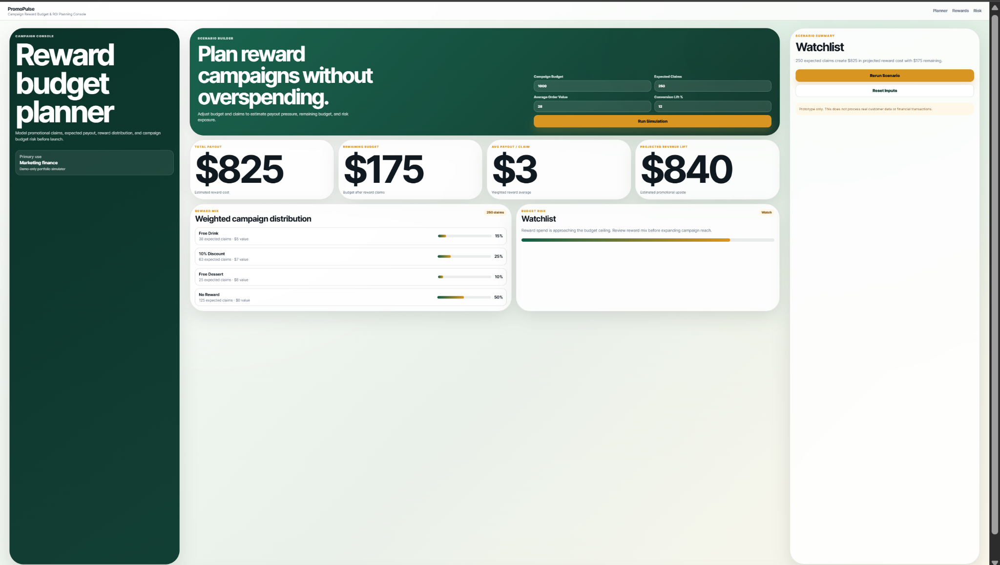

# PromoPulse Campaign Reward Budget & ROI Planning Console

## Live Demo

[Open the live deployed app](https://promopulse-campaign-reward-budget-roi-planning-conso-16u48fklz.vercel.app)

PromoPulse is a browser-based campaign planning dashboard for estimating promotional reward exposure, payout risk, and projected campaign lift before launching a reward campaign.

## Project Purpose

This project began as a Node.js command-line reward simulator and was upgraded into a lightweight marketing finance console. It helps teams model expected reward claims, compare budget usage, and identify when a campaign is safe, watchlisted, or over budget.

## Features

- Campaign budget input
- Expected reward claims input
- Average order value input
- Conversion lift estimate
- Weighted reward payout simulation
- Projected reward cost
- Remaining budget calculation
- Average payout per claim
- Estimated revenue lift
- Reward distribution panel
- Budget risk status
- Responsive dashboard layout
- Wide-screen and zoomed-out layout support

## Tech Stack

- HTML
- CSS
- JavaScript
- Node.js original simulator logic

## Run Locally

Open the browser dashboard:

```powershell
Start-Process .\index.html


---

## Dashboard Preview



